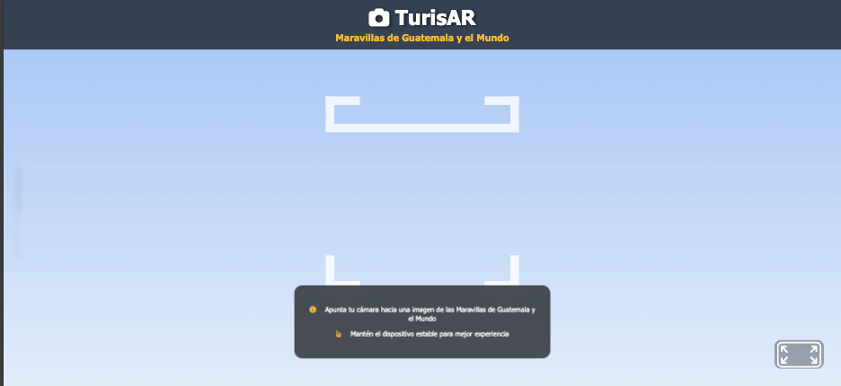

# IA1 Grupo 19 Proyecto TurisAR

TurisAR es un innovador sistema de Realidad Aumentada desarrollado por
estudiantes del curso Inteligencia Artificial 1 de la Universidad de San Carlos de
Guatemala, con el propósito de revolucionar el turismo a nivel global. Su objetivo es
proporcionar una experiencia interactiva y enriquecedora al permitir a los usuarios
acceder a información detallada sobre sitios icónicos al reconocerlos en tiempo real.
Como punto de partida, el proyecto se ha enfocado en fortalecer el turismo
guatemalteco mediante la integración de las 7 maravillas de Guatemala, junto con las
7 maravillas del mundo, ofreciendo datos históricos, culturales y multimedia que
fomentan el aprendizaje y la exploración intuitiva. TurisAR busca convertirse en una
herramienta de referencia para viajeros y estudiantes, con la visión de expandir su
alcance e incluir las maravillas y atracciones turísticas de distintos países,
promoviendo así la difusión del patrimonio cultural y natural a nivel internacional.

## Integrantes
- Pablo Medrano		201222552
- David García      201020136
- Martin Samayoa  	200915348

## Pantalla de inicio

## Experiencia AR

## Escaneo de Maravillas

## Interacción con el usuario

## Google Maps y Sitio Web externo

## Filtro

## Modulo Administrador

### Login y Panel Administrador

### Agregar y/o Editar Maravillas

### Subir JSON, Listar Maravillas, Editar y Eliminar Maravillas

